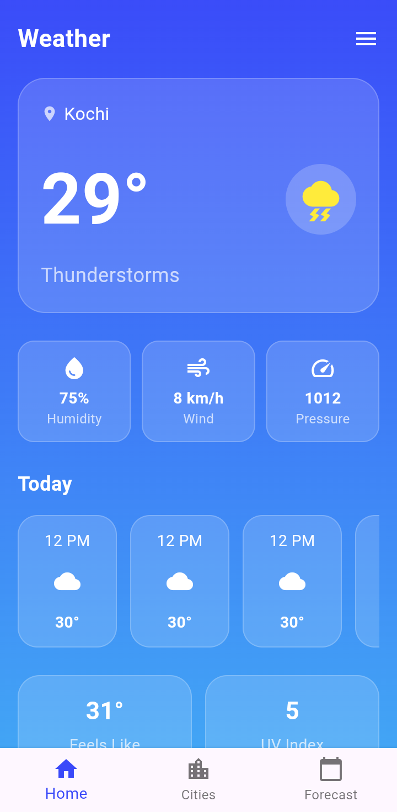
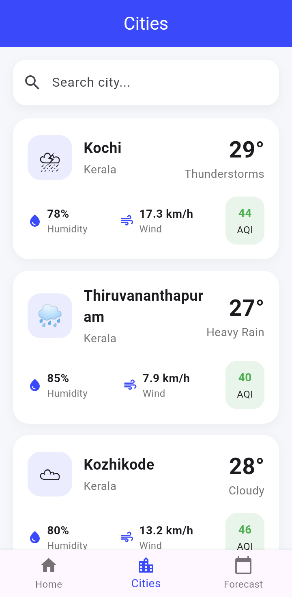
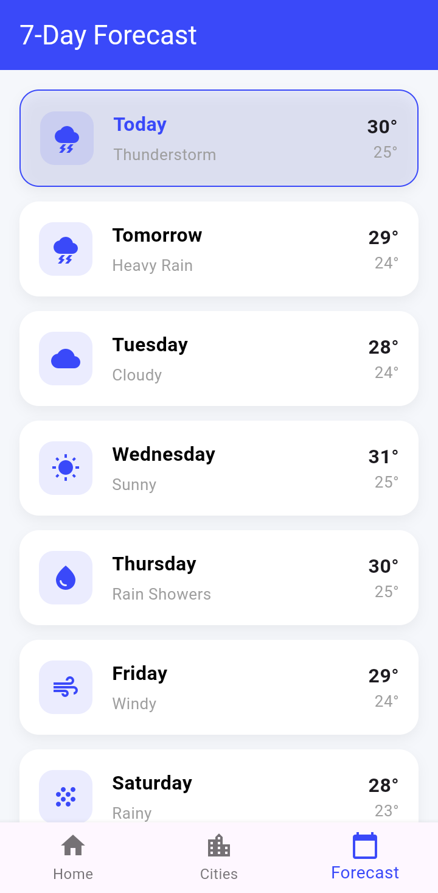

# Weather App

A clean and simple Flutter Weather App that fetches real‑time weather data using public APIs. Built with state management, featuring city search, forecast details and current weather updates.

## Features
- 🌍 Real-time weather data using public API  
- 🔎 Search weather by city name  
- 📍 Get weather for current location  
- 🌡️ Displays temperature, humidity, wind speed, and Air Quality
- 🎯 Clean and minimal UI design

## Screenshots

|                 Home Screen                  |                 Cities Screen                |               Forecast Screen                |
|:--------------------------------------------:|:--------------------------------------------:|:--------------------------------------------:|
|         |        |      |

  
